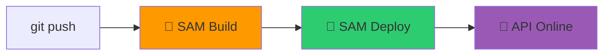
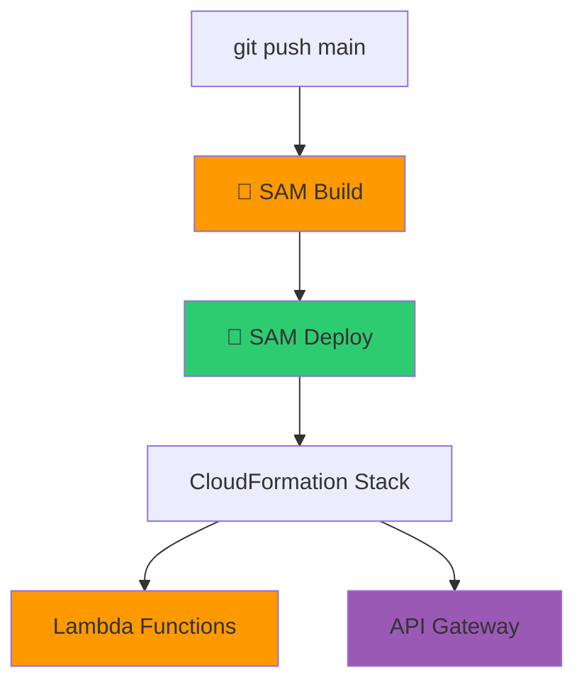

# 🎬 Vídeo 6.1 - Build e Teste de Aplicações Serverless

**Aula**: 6 - Serverless  
**Vídeo**: 6.1  
**Tema**: Como fazer o build e empacotamento de funções Lambda com o AWS SAM. Hands-on: Adicionando testes unitários e de integração ao pipeline de CI/CD.

---

## 🎯 Objetivo

Criar **pipeline CI/CD** para aplicações serverless com AWS SAM.



---

## 📁 Estrutura do Projeto (já existe)

```
fiap-dclt-aula06/
├── template.yaml          # SAM template (Lambda + API Gateway)
├── samconfig.toml         # Configurações de deploy  
├── src/
│   ├── handlers.py        # Funções Lambda
│   └── requirements.txt   # Dependências
└── .github/workflows/     # ← Vamos criar o pipeline aqui
```

---

## 🚀 Parte 1: Criar Pipeline CI/CD

### Passo 1: Criar diretório do workflow

**Linux/Mac:**
```bash
mkdir -p .github/workflows
```

**Windows (PowerShell):**
```powershell
New-Item -ItemType Directory -Force -Path ".github\workflows"
```

---

### Passo 2: Criar arquivo do workflow

**Linux/Mac:**
```bash
cat > .github/workflows/sam-pipeline.yml << 'EOF'
name: 🚀 SAM Pipeline CI/CD

on:
  push:
    branches: [main]
  workflow_dispatch:

env:
  AWS_REGION: us-east-1

jobs:
  # ========================================
  # JOB 1: Build e Deploy
  # ========================================
  deploy:
    name: 🚀 Build & Deploy
    runs-on: ubuntu-latest
    
    steps:
      - name: 📥 Checkout
        uses: actions/checkout@v4
      
      - name: 🐍 Setup Python
        uses: actions/setup-python@v5
        with:
          python-version: '3.9'
      
      - name: 🔧 Setup SAM CLI
        uses: aws-actions/setup-sam@v2
      
      - name: 🔑 Configurar AWS
        uses: aws-actions/configure-aws-credentials@v4
        with:
          aws-access-key-id: ${{ secrets.AWS_ACCESS_KEY_ID }}
          aws-secret-access-key: ${{ secrets.AWS_SECRET_ACCESS_KEY }}
          aws-session-token: ${{ secrets.AWS_SESSION_TOKEN }}
          aws-region: ${{ env.AWS_REGION }}
      
      - name: 🔨 SAM Build
        run: sam build
      
      - name: 🚀 SAM Deploy
        run: |
          sam deploy \
            --no-confirm-changeset \
            --no-fail-on-empty-changeset
      
      - name: 📋 Mostrar URL da API
        run: |
          aws cloudformation describe-stacks \
            --stack-name fiap-serverless-dev \
            --query 'Stacks[0].Outputs' \
            --output table
EOF
```

**Windows (PowerShell):**
```powershell
@"
name: 🚀 SAM Pipeline CI/CD

on:
  push:
    branches: [main]
  workflow_dispatch:

env:
  AWS_REGION: us-east-1

jobs:
  # ========================================
  # JOB 1: Build e Deploy
  # ========================================
  deploy:
    name: 🚀 Build & Deploy
    runs-on: ubuntu-latest
    
    steps:
      - name: 📥 Checkout
        uses: actions/checkout@v4
      
      - name: 🐍 Setup Python
        uses: actions/setup-python@v5
        with:
          python-version: '3.9'
      
      - name: 🔧 Setup SAM CLI
        uses: aws-actions/setup-sam@v2
      
      - name: 🔑 Configurar AWS
        uses: aws-actions/configure-aws-credentials@v4
        with:
          aws-access-key-id: `${{ secrets.AWS_ACCESS_KEY_ID }}
          aws-secret-access-key: `${{ secrets.AWS_SECRET_ACCESS_KEY }}
          aws-session-token: `${{ secrets.AWS_SESSION_TOKEN }}
          aws-region: `${{ env.AWS_REGION }}
      
      - name: 🔨 SAM Build
        run: sam build
      
      - name: 🚀 SAM Deploy
        run: sam deploy --no-confirm-changeset --no-fail-on-empty-changeset
      
      - name: 📋 Mostrar URL da API
        run: aws cloudformation describe-stacks --stack-name fiap-serverless-dev --query 'Stacks[0].Outputs' --output table
"@ | Out-File -FilePath ".github\workflows\sam-pipeline.yml" -Encoding UTF8
```

---

## ⚙️ Parte 2: Configurar GitHub Secrets

### Passo 3: Obter credenciais do Learner Lab

1. Acesse o **AWS Learner Lab**
2. Clique em **Start Lab** (se não estiver rodando)
3. Aguarde o indicador ficar 🟢 verde
4. Clique em **AWS Details**
5. Clique em **Show** ao lado de "AWS CLI"
6. Você verá algo assim:

```
[default]
aws_access_key_id=ASIAXXXXXXXXXXX
aws_secret_access_key=xxxxxxxxxxxxxxxxxxxxxxxxxxxxxxxx
aws_session_token=xxxxxxxxxxxxxxxxxxxxxxxxxxxxxxxx...
```

7. Copie cada valor (sem as aspas)

---

### Passo 4: Adicionar Secrets no GitHub

**No repositório GitHub:**

1. Vá para **Settings** (ícone de engrenagem)

2. No menu lateral, clique em **Secrets and variables** → **Actions**

3. Clique no botão **New repository secret**

4. **Adicionar primeiro secret:**
   - **Name**: `AWS_ACCESS_KEY_ID`
   - **Secret**: Cole o valor de `aws_access_key_id` do Learner Lab
   - Clique em **Add secret**

5. **Adicionar segundo secret:**
   - Clique em **New repository secret**
   - **Name**: `AWS_SECRET_ACCESS_KEY`
   - **Secret**: Cole o valor de `aws_secret_access_key` do Learner Lab
   - Clique em **Add secret**

6. **Adicionar terceiro secret:**
   - Clique em **New repository secret**
   - **Name**: `AWS_SESSION_TOKEN`
   - **Secret**: Cole o valor de `aws_session_token` do Learner Lab
   - Clique em **Add secret**

**Resultado final - você deve ter 3 secrets:**

```
┌─────────────────────────────────────────────────────┐
│ Repository secrets                                   │
├─────────────────────────────────────────────────────┤
│ 🔒 AWS_ACCESS_KEY_ID          Updated just now      │
│ 🔒 AWS_SECRET_ACCESS_KEY      Updated just now      │
│ 🔒 AWS_SESSION_TOKEN          Updated just now      │
└─────────────────────────────────────────────────────┘
```

> ⚠️ **IMPORTANTE - Learner Lab**: 
> - O Session Token **expira** quando a sessão termina
> - Você precisará **atualizar os 3 secrets** a cada nova sessão do Lab
> - Para atualizar: clique no 🔄 ícone ao lado do secret → cole novo valor

---

## 🧪 Parte 3: Testar Pipeline

### Passo 5: Commit e Push

**Linux/Mac/Windows:**
```bash
git add .github/workflows/sam-pipeline.yml
git commit -m "ci: add SAM pipeline"
git push origin main
```

### Passo 6: Verificar no GitHub Actions

1. Ir em **Actions** no repositório
2. Ver workflow **SAM Pipeline CI/CD**
3. Acompanhar execução:
   - ✅ SAM Build
   - ✅ SAM Deploy
   - ✅ Mostrar URL

### Passo 7: Testar a API

```bash
# Obter URL da API (após deploy)
API_URL=$(aws cloudformation describe-stacks \
  --stack-name fiap-serverless-dev \
  --query 'Stacks[0].Outputs[?OutputKey==`ApiUrl`].OutputValue' \
  --output text)

echo "API URL: $API_URL"

# Testar endpoints
curl $API_URL
curl $API_URL/health
curl $API_URL/info
```

---

## 📊 Fluxo do Pipeline



---

## 🧹 Limpeza

```bash
# Deletar stack
aws cloudformation delete-stack --stack-name fiap-serverless-dev

# Verificar
aws cloudformation list-stacks --stack-status-filter DELETE_COMPLETE
```

---

**FIM DO VÍDEO 6.1** ✅

**Próximo**: Vídeo 6.2 - Deploy Multi-Ambiente (staging → production)
